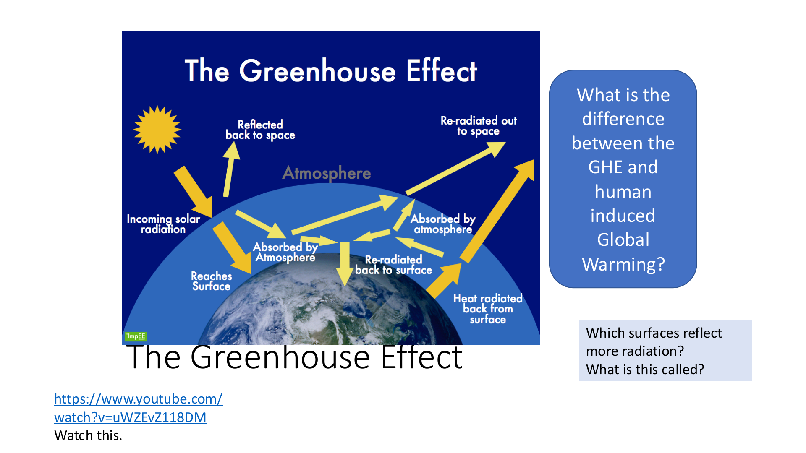
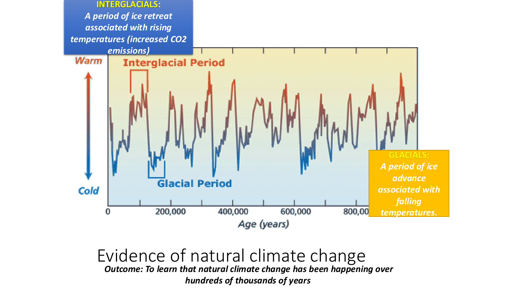
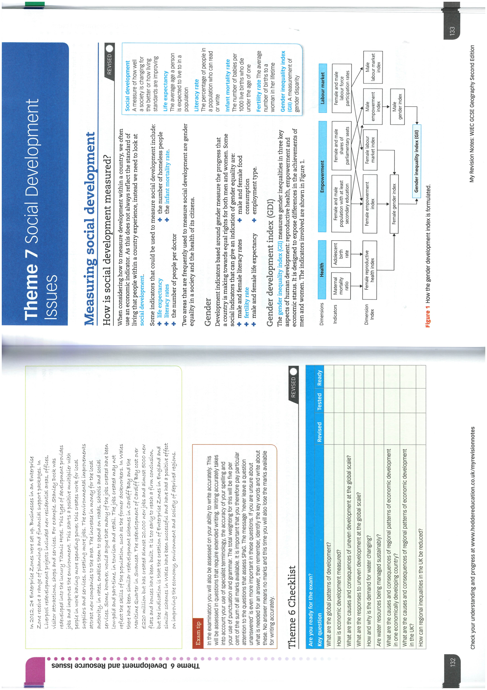
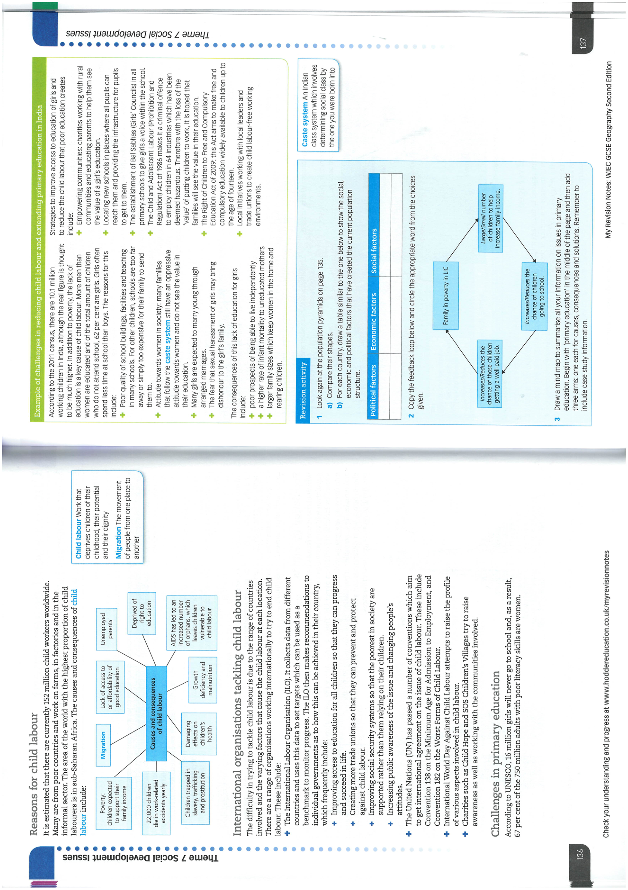

# Geography Revision Notes

## Revision Topic List (EOY 2026)
- [Climate Change](#climate-change-revision)
- [Social Development](#social-development-revision)

## Exam Info (EOY 2026)
- **Duration**: 1 hour
- **Sections**: 2 — Climate Change and Social Development (Theme 7)

## Curriculum Overview (2025-26)

### Autumn Term
- **Superpowers**: Factors affecting superpower status; historical context and the legacy of colonialism; international trade and the rise of the BRICS nations.
- **Prisoners of Geography**: Analysis of Tim Marshall’s work; the relationship between physical geography and geopolitics, with a focus on Russia and Africa.

### Spring Term
- **Climate Change**: Issues of impact and mitigation; debating viewpoints via a MUN-style global conference.
- **Social Development (GCSE)**: Avoiding "the single story"; how social development is measured using gender and health metrics; understanding the development gap and continuum.

### Summer Term
- **Development Challenges (GCSE)**: Population structure and pyramids; challenges in South Asia and Sub-Saharan Africa including child labour, girls' education, and refugee movements.
- **Health Care**: Specific focus on Sub-Saharan Africa (Infant mortality, HIV, Malaria); comparison of Top-down vs. Bottom-up development strategies.

---

## Neo-Colonialism and India's Involvement in Africa
*(Assessment topic — 8/11)*

### 1. Key Concept: Neo-Colonialism
- **Definition:** Economic and political dominance of a powerful country over a less developed one through indirect means (trade, investment, debt) rather than direct political control.
- Contrast with colonialism: no direct territorial control, but economic dependency persists.

### 2. India–Africa Trade Relationship
- India is a rising global economic power with growing trade ties in Africa.
- Africa supplies raw goods (e.g. cobalt, minerals); India profits from manufacturing and re-selling.
- Trade structure remains unequal — typical of neo-colonial relationships.

### 3. Evidence of Neo-Colonial Characteristics
- Large-scale land deals: e.g. displacement of ~1.5 million people in Ethiopia for Indian-leased farmland.
- Africa's dependence on Indian manufactured goods increases over time.
- Indian extraction of African mineral resources (cobalt etc.) for India's own industry.

### 4. Evidence of Cooperation
- India funds infrastructure projects and manages them with African government involvement.
- Technology sharing, scholarships, and few political conditions attached to investment.
- Indian military and strategic cooperation strengthens bilateral bond.
- African governments retain control over projects funded by India.

### 5. Conclusion
- The relationship has both neo-colonial and cooperative elements.
- Until exploitation (unequal trade, land displacement) is resolved, it remains **mainly neo-colonial with cooperative aspects**.

---

## Plastic Waste

### 1. The Problem with Plastic
- **Durability:** Plastics are designed to last, which means they do not break down easily in the environment (non-biodegradable).
- **Microplastics:** Larger plastics break down into tiny particles (microplastics) that enter the food chain and water supply.
- **Single-use Culture:** High reliance on disposable items (straws, bags, bottles) creates massive amounts of waste.

### 2. Impacts
- **Marine Life:** Animals (turtles, seabirds, fish) mistake plastic for food or get entangled in it.
- **Human Health:** Potential toxic chemicals leaching from waste; microplastics found in human bodies.
- **Great Pacific Garbage Patch:** Massive accumulation of floating plastic debris in the North Pacific Ocean.

### 3. Solutions ('The 3 Rs')
- **Reduce:** Minimize consumption of single-use plastics (e.g., use reusable bottles).
- **Reuse:** Use items multiple times before discarding.
- **Recycle:** Process waste materials into new products (though not all plastics are recyclable).
- **Alternatives:** Research into biodegradable plastics and plant-based alternatives.

---

## Climate Change [REVISION]

> **Resources**: Exercise book · Revision PPT on TEAMS · [BBC Bitesize — Climate Change](https://www.bbc.co.uk/bitesize/guides/zx234j6/revision/1)

### Key Definitions
- **Global warming**: The rise in average global temperatures due to an enhanced greenhouse effect.
- **Climate change**: Long-term shifts in global temperatures and weather patterns caused by global warming.
- **Greenhouse effect**: Natural process where greenhouse gases (CO₂, methane, water vapour) absorb outgoing heat radiation and re-radiate it back to Earth's surface, keeping it warm.

- **Enhanced greenhouse effect**: Human activities increase concentrations of greenhouse gases, trapping more heat and causing additional warming beyond the natural greenhouse effect.
- **Albedo**: The ability of a surface to reflect solar radiation. Light surfaces (ice, snow) have high albedo and reflect more energy back to space; dark surfaces (ocean, forests) absorb more.

### Natural Climate Change
- Climate has always changed naturally over thousands of years — long before human influence.
- **Glacials**: Periods of ice advance associated with falling temperatures.
- **Interglacials**: Periods of ice retreat associated with rising temperatures and increased CO₂.
- Ice core data shows these cycles repeating over 800,000+ years.

### Greenhouse Gases and Sources
| Gas | Formula | Main Sources |
|---|---|---|
| Carbon dioxide | CO₂ | Burning fossil fuels (coal, oil, gas); deforestation |
| Methane | CH₄ | Paddy fields, landfill sites, livestock (cows) |
| Nitrous oxide | N₂O | Combustion engines in cars |
| Water vapour | H₂O | Evaporation from oceans (natural) |

### Evidence for Rising Temperatures
- **Instrument readings**: Thermometer records since 1850 show a clear warming trend. Limitations: some readings affected by urbanisation and vegetation overgrowth.
- **Glacier retreat**: World Glacier Monitoring Service reported significant retreat since 1980; estimated 25% of mountain glaciers gone by 2050.
- **Arctic ice cover**: Arctic ice has thinned to almost half its thickness over 30 years; summer cover dramatically reduced.
- **Ice cores**: Annual snow layers trap air and water molecules; analysis gives precise temperature records going back hundreds of thousands of years.
- **Historical records**: Spring arrives ~3 weeks earlier than in the past; milder winters; fewer frost days — evidence of a seasonal shift.

### Effects of Global Warming
- **Rising sea levels**: Ice caps and glaciers melt → coastal flooding and displacement.
- **Extreme weather**: More frequent and intense storms, droughts, heatwaves.
- **Ecosystem disruption**: Habitat loss, coral bleaching, species migration/extinction.
- **Food and water insecurity**: Changing rainfall patterns reduce crop yields.
- **Human displacement**: Low-lying areas (e.g. Bangladesh, Pacific islands) at risk.

### Management: Mitigation vs Adaptation
- **Mitigation** — reducing the *causes* of climate change:
    - Alternative/renewable energy production (solar, wind, hydroelectric).
    - Carbon capture and storage.
    - Planting trees (reforestation).
    - International agreements: **Kyoto Protocol** (1997) and **COP21 / Paris Agreement** (2015 — limit warming to 1.5°C).
- **Adaptation** — responding to the *effects* of climate change:
    - Change in agricultural systems (drought-resistant crops).
    - Managing water supply.
    - Reducing risk from rising sea levels (sea defences, flood barriers, relocating communities).

---

## Social Development [REVISION]

> **Resources**: Exercise book · Revision pack on TEAMS · [BBC Bitesize — Social Development](https://www.bbc.co.uk/bitesize/topics/zg6x2nb)

### Measuring Social Development
- **Social development**: A measure of how well a society is changing for the better — how living standards are improving.
- **Life expectancy**: Average age a person is expected to live to. Usually calculated separately for men and women.
- **Literacy rate**: % of a population who can read or write.
- **Birth rate**: The number of children born in one year for every 1,000 people in a country's population.
- **Infant mortality rate (IMR)**: Number of babies per 1000 live births who die under age one.
- **Fertility rate**: Average number of children a woman has in her lifetime.
- **Primary health care**: The first point of contact between a health care worker and a patient. May involve preventative care, e.g. immunisation.
- **Net immigration**: When more people move into a region than leave it.
- **Remittances**: Money sent by migrant workers back home to support their families.

**Indicators used:**
- Life expectancy · Literacy rates · Number of people per doctor · Infant mortality rate

**Gender indicators** — measure equality between men and women:
- Male and female literacy rates · Fertility rate · Male and female food consumption · Employment type

**Gender Development Index (GDI)**: Measures gender inequalities in health, empowerment, and labour market across men and women.

**Gender Inequality Index (GII)**: Measures gender disparities across health, empowerment, and labour market dimensions.

**Human Development Index (HDI)**: Combines life expectancy + education (literacy rates + years of schooling) + GNI per capita. Brings together social and economic factors.

**Gross National Income (GNI) per capita**: The average income in a country per person.

**Continuum of social development**: Development is a continuous process — countries are not simply "developed" or "developing" but exist on a spectrum. The development gap measures the difference between the world's richest and poorest countries.

---

### Birth and Death Rates

| | Factors → **higher** birth rates | Factors → **lower** birth rates |
|---|---|---|
| Social | Children provide labour on farms; large families as sign of virility; girls marry early | Women educated, follow careers; high cost of living means expensive to raise children |
| Economic | Women lack education and may stay in family rather than work | Higher spending on material goods (cars, holidays) |
| Political | High infant mortality encourages larger families | Birth control readily available |

| Factors → **higher** death rates | Factors → **lower** death rates |
|---|---|
| Covid-19 and other difficult conditions to control diseases | Better healthcare and vaccination programmes available |
| In HICs, higher proportion of elderly (ageing societies) | Less physically demanding jobs — less stress |
| | People educated about health and hygiene; water supplies reliable and cleaner |

**Population pyramids**: Graphs dividing population into 5-year age groups split by male and female. Show the age and gender structure of a population.

---

### Child Labour
- **Definition**: Work that deprives children of their childhood, education, and is harmful to their health/development.
- **Scale**: ~152 million child workers worldwide; highest proportion in Sub-Saharan Africa; 22,000 children die in work-related accidents yearly.
- **Causes**: Poverty, lack of access to good education, unemployed parents, AIDS creating orphans, damaging effects on children's health.
- **Effects**: Perpetuates poverty cycle — children miss education → limited future earnings; migration; growth deficiency/malnutrition.

**International organisations tackling child labour:**
- **ILO (International Labour Organisation)**: Collects data from countries, sets targets, makes recommendations to governments.
- **UN Convention 138**: Minimum age for employment. **Convention 182**: Worst forms of child labour to be abolished.
- **Charities**: SOS Children's Villages, Child Hope — raise awareness and work with communities.

**Case study — Primary education challenges in India:**
- 62% of child labourers are girls; more men than women are educated.
- **Caste system**: An Indian class system — the class you are born into largely determines your opportunities.
- Girls face sexual harassment, arranged marriages, family attitudes that education is "dishonourable".
- **Strategies**: Empowering communities; locating new schools where all pupils can attend; establishment of Bal Sabhas (Girls' Councils); the Child and Adolescent Labour Act 1986; Right of Children to Free and Compulsory Education Act 2009.

---

### International Refugees and Asylum Seekers

**Key definitions:**
- **Economic migrant**: Person who moves with the hope of earning more money.
- **Asylum seeker**: Person who moves to another country and applies for recognition as a refugee, waiting for a decision.
- **International refugee**: Person forced to leave their home country, unable to return.
- **Push factors**: Factors that make people want to leave a place (conflict, persecution, disaster).
- **Pull factors**: Factors that attract people to a place (safety, better services, family).

**Scale**: Since 2000, increasing numbers from Africa, Middle East, South Asia entering Europe — Syria, Afghanistan, Iraq, Eritrea, Somalia. Lebanon hosts ~1.5 million Syrian refugees (30% of its population).

**Case study — Lebanon:**
- Small country (4.5 million people) receiving the most refugees per capita in the world.
- Impacts: strain on infrastructure, housing, education, public health; tent cities and squatter settlements; spread of disease; Lebanon received £2.3 billion in aid.

**International agreements:**
- **Schengen Agreement (1995)**: Passport-free movement between signing EU states. Not all countries signed — UK/Ireland opted out.
- Increasing illegal crossings of the Mediterranean → border controls temporarily reintroduced in some states; Operation Sophia (naval monitoring); anti-smuggling and trafficking operations.

**Tackling refugees:**
- Germany and Sweden accepted large numbers; UK agreed to accept 20,000 from Syria by 2020 (17,051 settled by 2019).

---

### Healthcare Issues in Sub-Saharan Africa

Sub-Saharan Africa has the highest infant mortality rates in the world (78 deaths per 1000 live births in 2018). Reasons: neonatal infections, diarrhoea diseases, lack of vaccinations, mosquitoes.

**Malaria:**
- Caused by parasites spread by infected mosquitoes; preventable but kills ~405,000/year; Malawi is severely affected.
- **Strategies**: Insecticide-treated bed nets (80% coverage target); indoor residual spraying (IRS); vaccination programme (2019).

**HIV/AIDS:**
- ~38 million people worldwide living with HIV; 1.8 million in Sub-Saharan Africa.
- Malawi: average life expectancy 50 years; children often drop out of school to care for parents.
- **Strategies (Malawi — top-down)**: Anti-retroviral treatment (ART); free condoms; investment in health clinics; medication for pregnant women to prevent transmission to baby. Life expectancy rose from 49 (2005) to 63 (2018).

---

### Top-down vs Bottom-up Approaches

| | Top-down | Bottom-up |
|---|---|---|
| **Who decides** | National government or large organisation | Local community |
| **Scale** | Large | Small |
| **Cost** | High | Low |
| **Sustainability** | Less sustainable | More sustainable |
| **Example** | WHO Malaria prevention conference (experts discuss global strategies) | WaterAid: trains local pump mechanics; provides clean water using underground stones pumped up locally |

---

### Measuring Progress: MDGs and SDGs

**Millennium Development Goals (MDGs)** — measured progress 2000–2015:
- MDG 1: Eradicate extreme hunger and poverty
- MDG 2: Achieve universal primary education
- MDG 4: Reduce child mortality
- MDG 5: Reduce maternal mortality

**Sustainable Development Goals (SDGs)**: 17 goals (replaced MDGs) — aim to end poverty, protect the planet and ensure peace and prosperity. Measured by UNDP.

**HDI progress example (2018)**: Botswana — medium HDI 0.728; Angola — low HDI 0.574; Niger — very low HDI 0.377.
