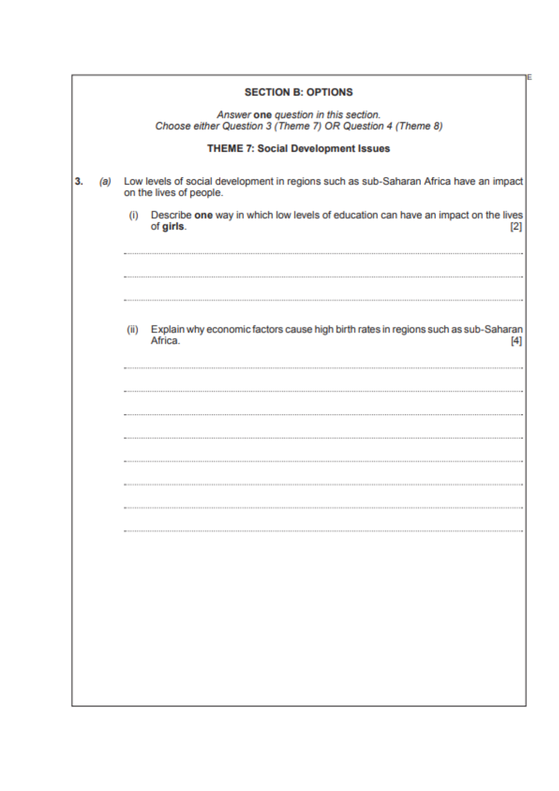
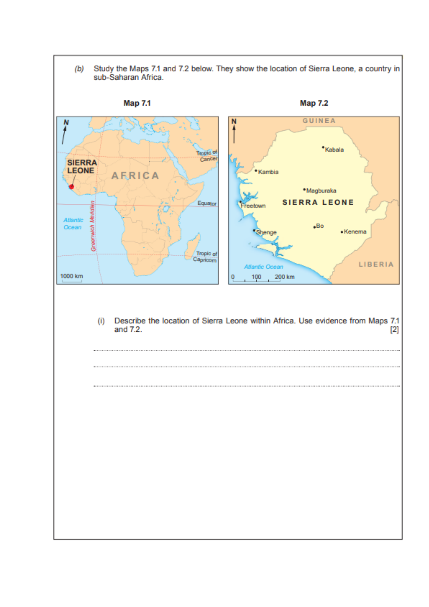
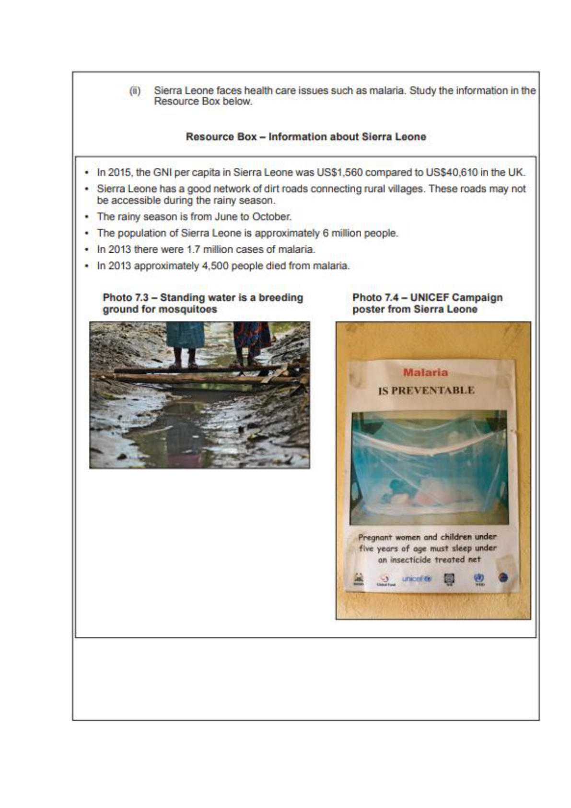

# Geography — Theme 7: Social Development Issues
## Past Question Papers (WJEC/EDUQAS)

*Source: geo-2.pdf — Theme 7 Revision Booklet*

---

## 2018 EDUQAS — Question 3

![2018 Q3 page 4 — answer space: malaria prevention in Sierra Leone [8 marks]](../../images/geography/geo-2-qp-p4.png)

---

## 2019 EDUQAS — Question 3

![2019 Q3 page 1 — Map 3.1: child labour by region; child labour prevalence [2+4 marks]](../../images/geography/geo-2-qp-p5.png)

![2019 Q3 page 2 — child labour explanation; two factors causing refugees [4+2 marks]](../../images/geography/geo-2-qp-p6.png)

![2019 Q3 page 3 — Resource Box 3.2: Syrian refugee children; refugee initiatives [8 marks]](../../images/geography/geo-2-qp-p7.png)

![2019 Q3 page 4 — answer space: refugee initiatives success [8 marks]](../../images/geography/geo-2-qp-p8.png)

---

## 2018 WJEC — Question 3

![2018 WJEC Q3 page 1 — Angola population data table (2000–2014); birth rate definition; median literacy [1+1]](../../images/geography/geo-2-qp-p9.png)

![2018 WJEC Q3 page 2 — describe death rate changes; analyse GDP/literacy/population [4+6 marks]](../../images/geography/geo-2-qp-p10.png)

![2018 WJEC Q3 page 3 — factors affecting birth rates; age of women starting family; children in Angola table [3+2+1]](../../images/geography/geo-2-qp-p11.png)

![2018 WJEC Q3 page 4 — Photo: children working in Angola; consequence of work; girls in education [2+4 marks]](../../images/geography/geo-2-qp-p12.png)

---

## 2019 WJEC — Question 3

![2019 WJEC Q3 page 1 — Map: top 5 asylum origin countries to EU 2016; highest country [1 mark]](../../images/geography/geo-2-qp-p13.png)

![2019 WJEC Q3 page 2 — pattern of asylum seekers; map adaptation; refugees from sub-Saharan Africa/Asia [3+2+6]](../../images/geography/geo-2-qp-p14.png)

![2019 WJEC Q3 page 3 — definitions matching (development gap, continuum, gender/health measures); Resource Box: malaria bottom-up vs top-down [4 marks]](../../images/geography/geo-2-qp-p15.png)

![2019 WJEC Q3 page 4 — answer space: bottom-up vs top-down approaches to healthcare [8 marks]](../../images/geography/geo-2-qp-p16.png)
