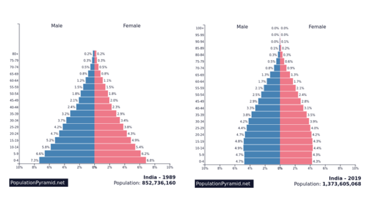

# Geography — Social Development Revision Questions

**Theme 7: Social Development**

---

**Instructions:** Answer all questions. Use your revision guide and textbook notes on Theme 7 to support your answers.

---

**1.** Number of people per doctor is one measure of social development. Give **3 other** ways in which social development can be measured.

&nbsp;

(a) _______________________________________________

(b) _______________________________________________

(c) _______________________________________________

*[3 marks]*

---

**2.** Explain why measures of social development such as people per doctor are useful in showing how developed a country is.

&nbsp;

_______________________________________________

_______________________________________________

_______________________________________________

_______________________________________________

*[4 marks]*

---

**3.** Explain why death rates remain high in some countries in Sub-Saharan Africa.

&nbsp;

_______________________________________________

_______________________________________________

_______________________________________________

_______________________________________________

_______________________________________________

*[4 marks]*

---

**4.** The population pyramids below show India in 1989 and 2019.

Explain why the shape of the pyramid has changed between 1989 and 2019.

&nbsp;

_______________________________________________

_______________________________________________

_______________________________________________

_______________________________________________

_______________________________________________

*[4 marks]*

---

**5.** Give **2 reasons** why child labour is an issue in some parts of the world.

&nbsp;

(a) _______________________________________________

_______________________________________________

(b) _______________________________________________

_______________________________________________

*[2 marks]*

---

**6.** Explain why there is gender inequality in relation to the education of girls in some countries.

&nbsp;

_______________________________________________

_______________________________________________

_______________________________________________

_______________________________________________

*[4 marks]*

---

**7.** Describe how the issues of child labour and the education of girls can be tackled.

&nbsp;

_______________________________________________

_______________________________________________

_______________________________________________

_______________________________________________

_______________________________________________

*[4 marks]*

---

**8.** Give **3 reasons** why some people become refugees.

&nbsp;

(a) _______________________________________________

(b) _______________________________________________

(c) _______________________________________________

*[3 marks]*

---

**9.** Describe how issues related to refugee movements can be tackled.

&nbsp;

_______________________________________________

_______________________________________________

_______________________________________________

_______________________________________________

*[4 marks]*

---

**10.** Explain why there are high rates of infant mortality in some parts of Sub-Saharan Africa.

&nbsp;

_______________________________________________

_______________________________________________

_______________________________________________

_______________________________________________

_______________________________________________

*[4 marks]*

---

**11.** Describe the challenges created by HIV and malaria for people living in Sub-Saharan Africa.

&nbsp;

_______________________________________________

_______________________________________________

_______________________________________________

_______________________________________________

_______________________________________________

*[4 marks]*

---

**12.** How can HIV and malaria be tackled at a **local** scale? And on a **global** scale?

&nbsp;

**Local scale:**

_______________________________________________

_______________________________________________

_______________________________________________

**Global scale:**

_______________________________________________

_______________________________________________

_______________________________________________

*[4 marks]*

---

**13.** Describe the difference between top-down and bottom-up approaches to development.

&nbsp;

_______________________________________________

_______________________________________________

_______________________________________________

_______________________________________________

_______________________________________________

*[4 marks]*

---

**Total: 48 marks**
