# yr 9 Algebra Revision Spring

- Simplify
 
-  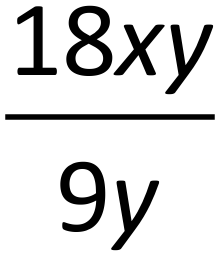
 
-  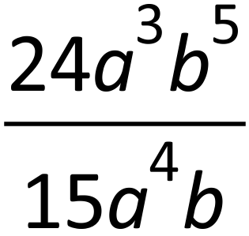
 
-  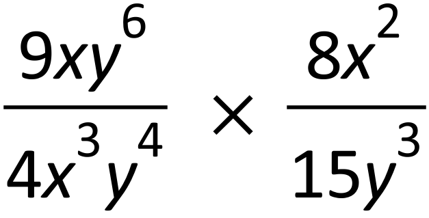
 
-  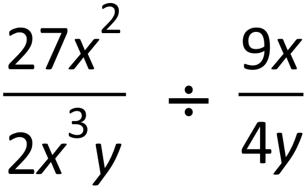
 
-  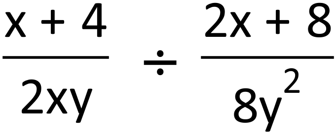
 
-  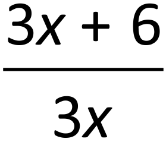
 
-  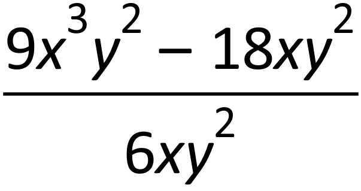
 
-  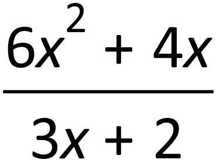
 

- Write the following as a single fraction

 

- 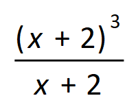
 
-  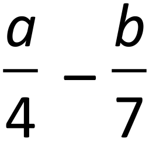
   
-  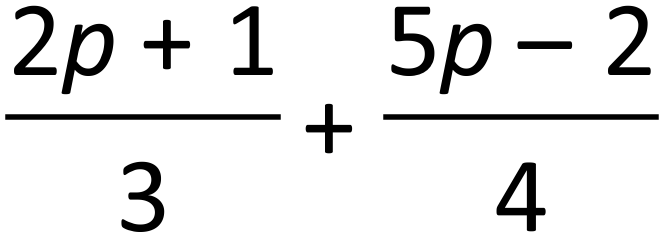

- 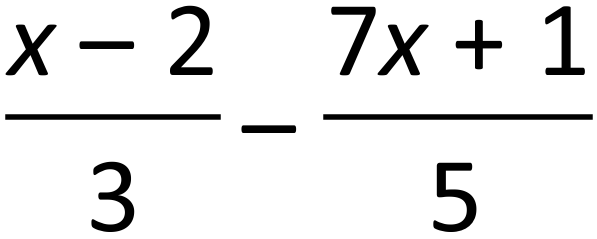
 
-  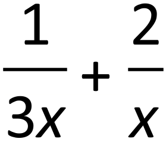
 
-  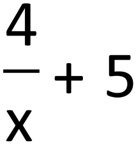
 
-  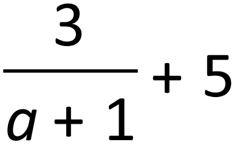
 
-  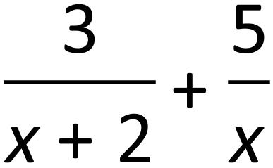

- 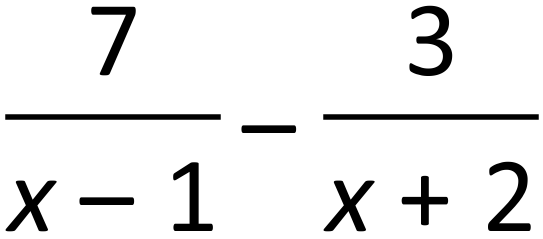

- Solve equations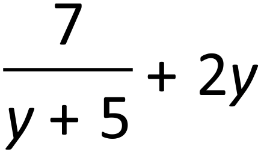
  
-  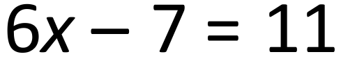
 
-  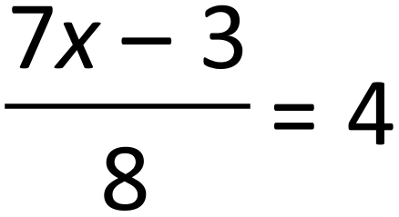
 
-  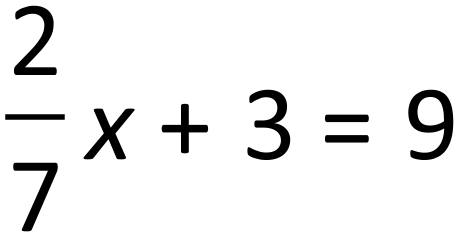
 
-  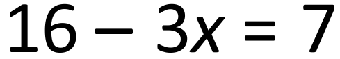
 
- 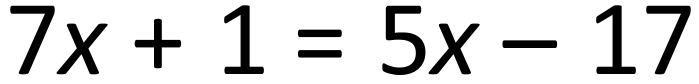

- 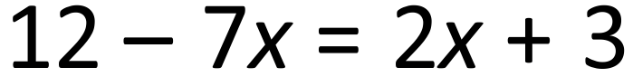
 
-  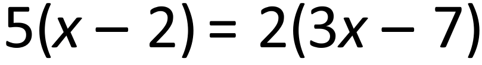
 
-  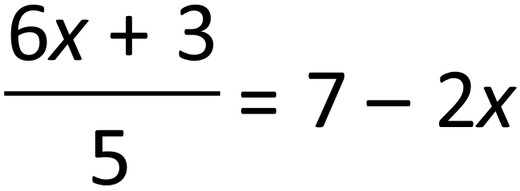

-  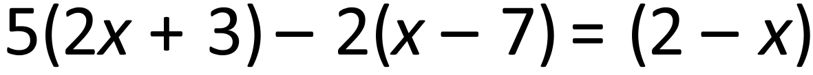
  
-  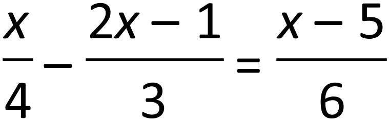
 
-  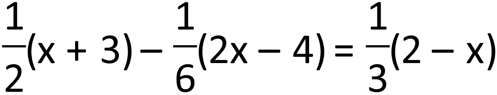
 
- 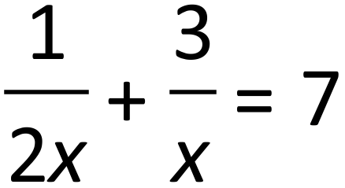

- Solve equations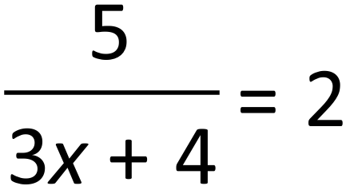
  
- 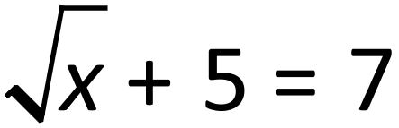

- 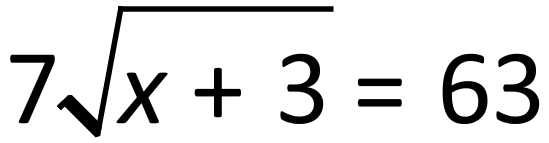
 
-   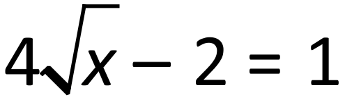
 
-  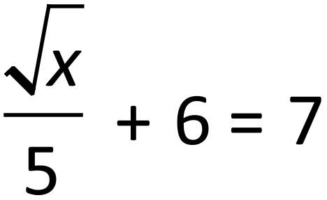
 
-  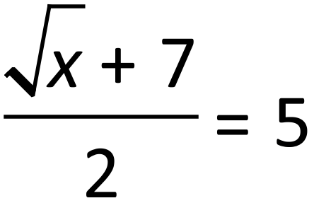

-    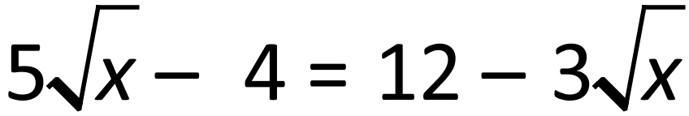
 
- 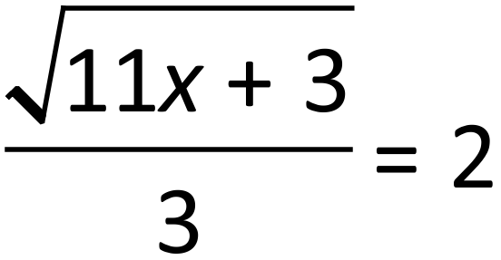

-  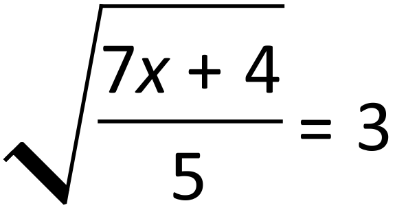
 
-  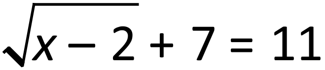

- Solve the following equations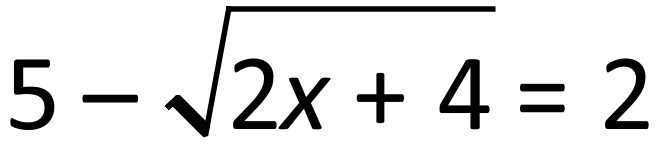
  
- 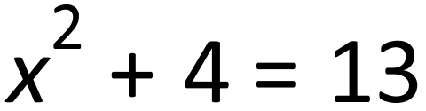
 
-  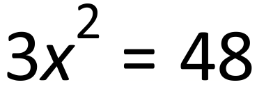
 
-  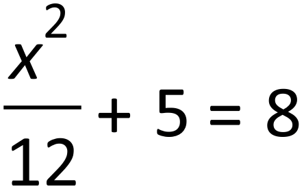
 
-  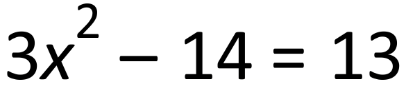
 
-  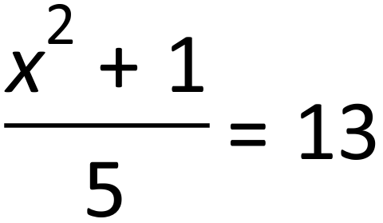
 
- 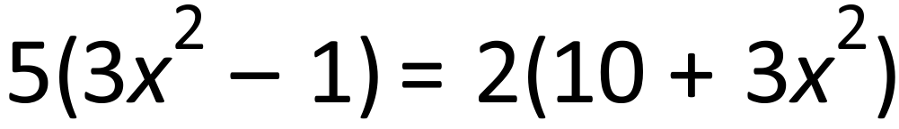
  
-  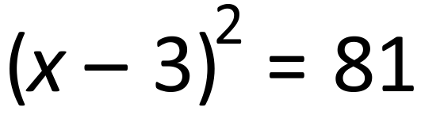
 
-  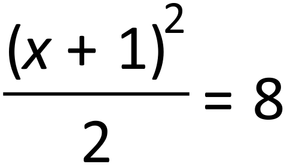
 
- 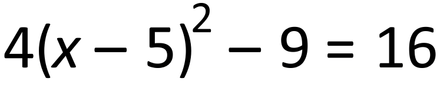
 
-  
 
-  

- Solve the following simultaneous equations
  
-  
 
-  
 
-  
 
-  
 
-  
 

- Factorise fully
  
-  
 
-  
 
-  
 
-  
 
- 
 
-  
 
-  
 
-  
 
-  
 
-  
 
-  

- Solve the inequalities and illustrate the solution on the number line 
 

 

-  
 

 

-  
 

 

- 

**For the Q9 to Q16 set up an equation first and solve it to answer the question.**

-  Find all the angles of the cyclic quadrilateral.

- The length of a rectangle is 5cm more than its width. Find the area of this rectangle if the perimeter is 26cm. 
- The sum of four consecutive numbers is 450. Find these numbers.
- A two digit number is increased by 27 when the digits are reversed and the sum of the digits is 7. Find the original number.
- Simon and Josh have £44 together. If Simon’s money is doubled and Josh’s tripled they will have £109 altogether. How much does each boy have?
- Henry participates in 10K charity run (10 km). He runs some of it at 12km/h and walks the rest of the way at 4 km/h. He finishes in 1 hour. For how long and what distance did Henry run?
- A book of 45 postage stamps contains both 1st and 2nd class stamps at price 62p for a 1st class and 53p for a 2nd class stamp. How many 1st class stamps are in the book if it costs £27.