# Yr 9 Graphs Revision Spring 2026

- What is the gradient of a straight line 

 which passes through points AB

- A (6, 4) and B(3, 1)
- A(3, 4) and B(2, 7)
- A(2, -7) and B(5,-2)

- Find the equation of line passing through the points(2, 9) and (0, 5)
- (3, 4) and (8, 19)
- (2, 7) and (-2, 3)

- A straight line passes through (3, 5) and (1, y). 

Find y if the gradient of this line is 

- 1
- -2
- 0

- What is the gradient and y-intercept of the following lines 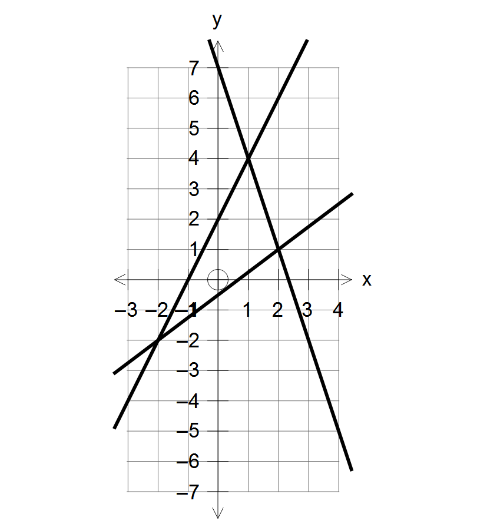
 
-  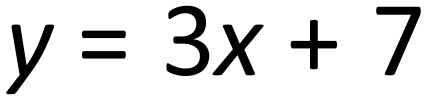
 
-  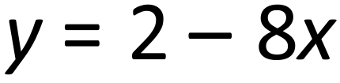
 
-  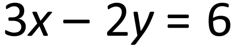
 

- A straight line has equation y = 7x + 9. The point P lies on the straight line.
The coordinates of P are 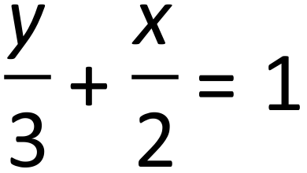
 . 

Find the x coordinate of P.

- Write an equation of a straight line which passes through point (4, 3) and has a gradient 2.
- A straight line is **parallel** to y = 3x – 2 and passes through the point (2 , 7). 

Find the equation of this line.

-  a. Put a tick (
) underneath the equations which are the equations of a straight line that is **parallel **to the line with equation y = 2x – 3

|  |  |  |  |  |  |
|  |  |  |  |  |  |

- Determine the equation of each of the following lines:

a)						b)	                       
            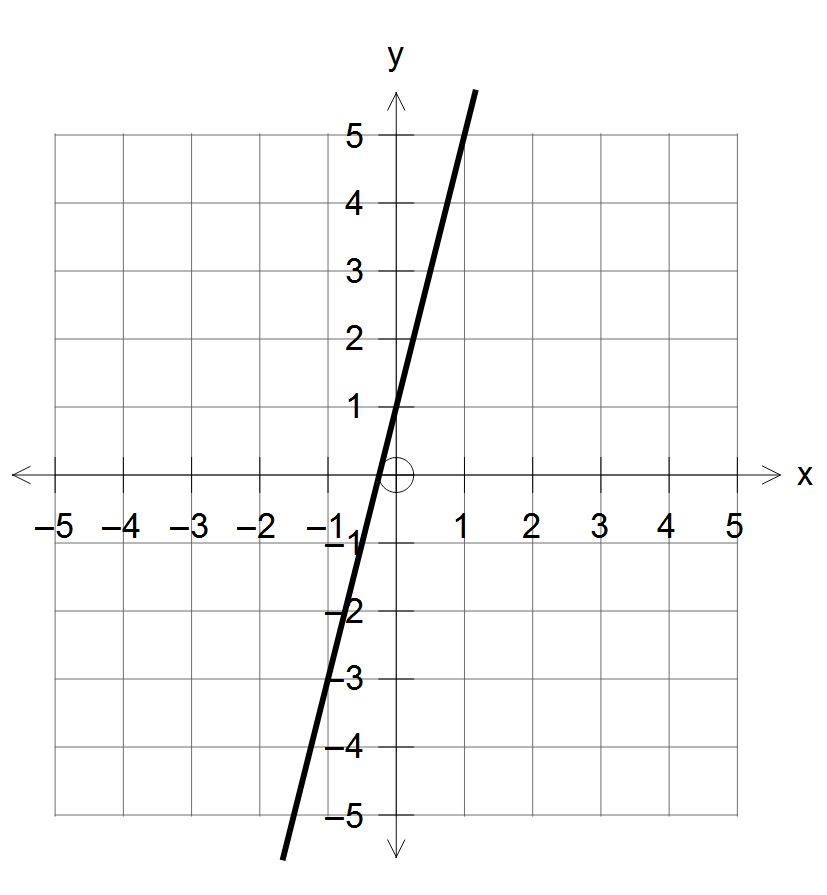

c)						d)	               	  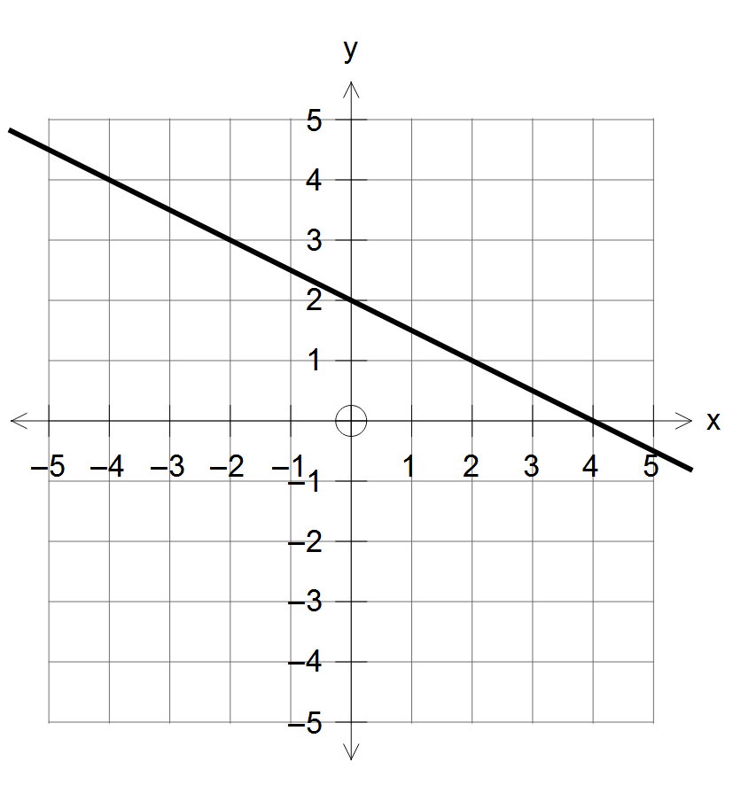
           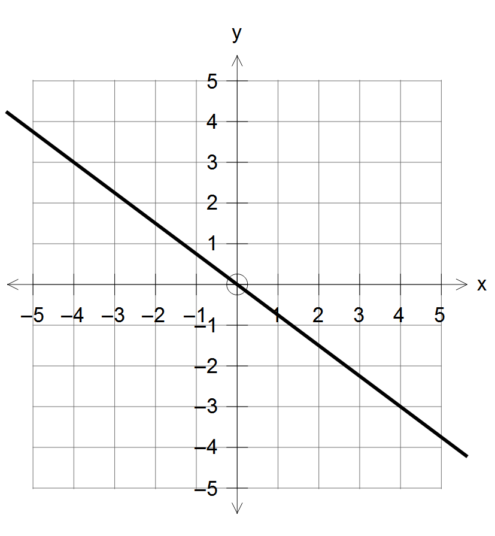

e)						f)			                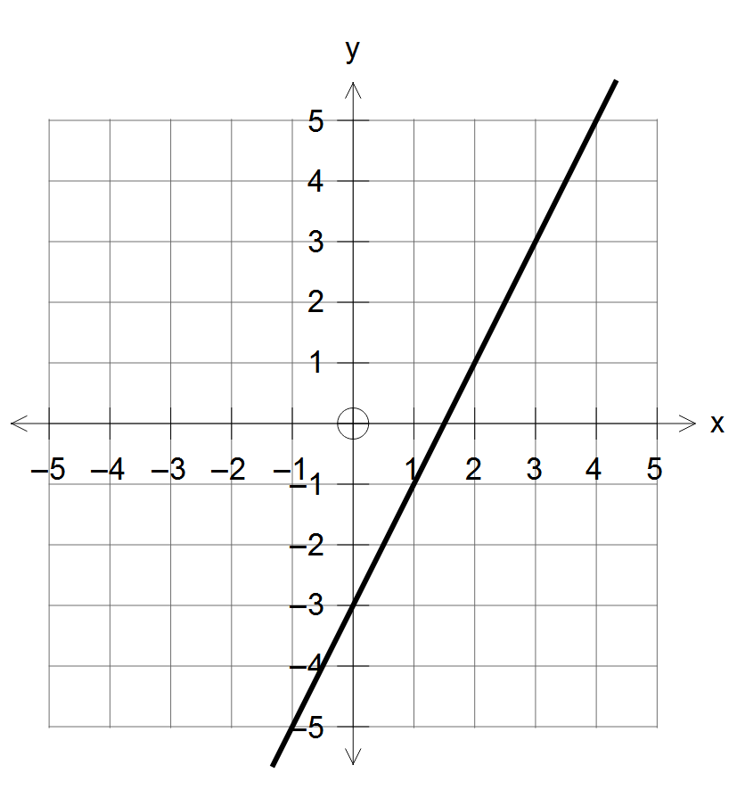
         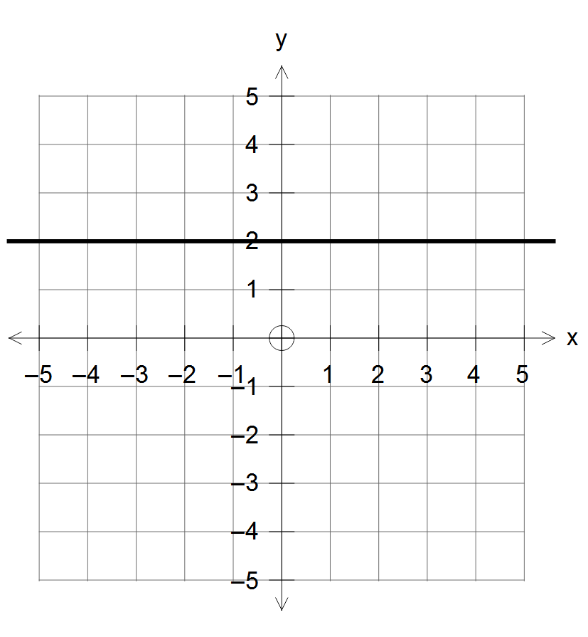

- Draw the lines with equations:

a)	 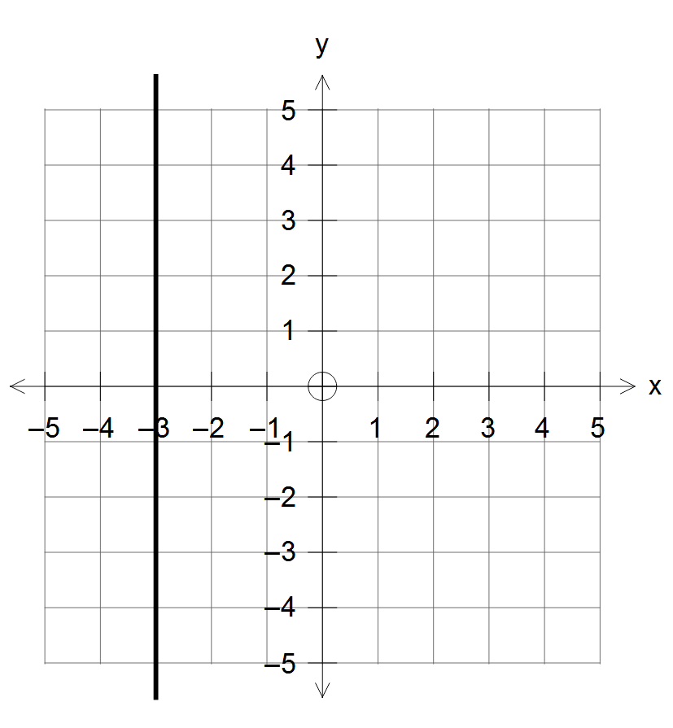
 					b)	 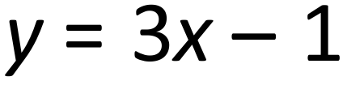
 			

                

c)	 
 					d)	 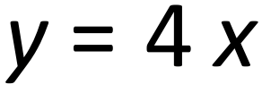
  							

                

e)	 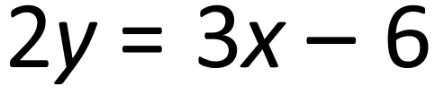
 					f)	 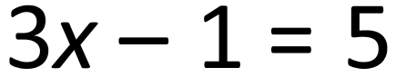
  							

                

- The graph  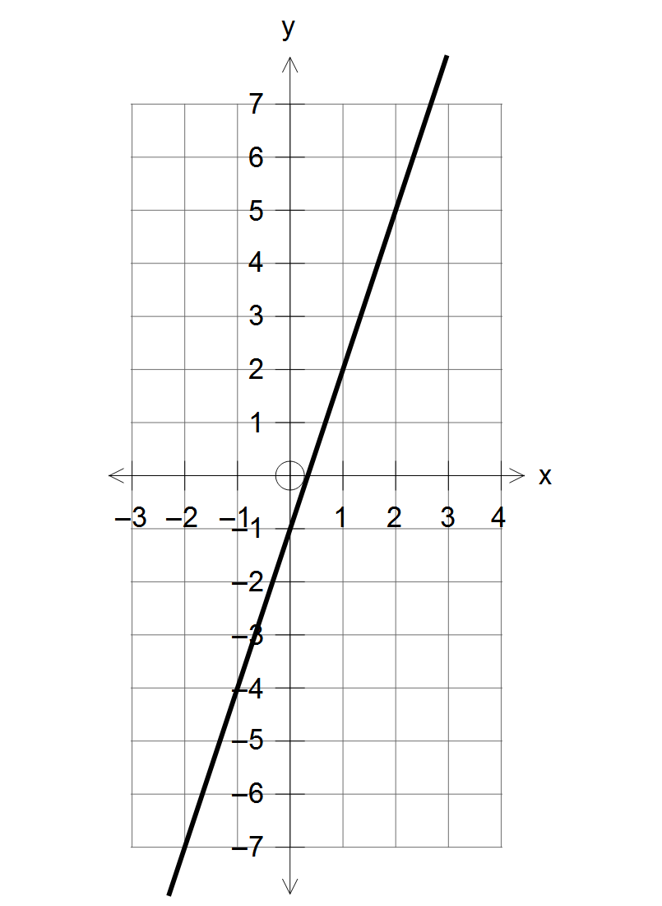
 is shown. Use the graph to solve the equations:

a) 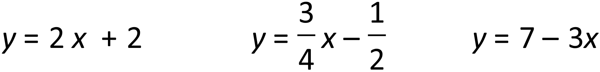
		b)   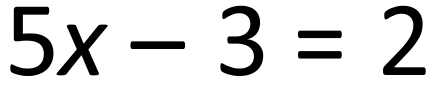
        c) 
 		d) 
 

- The graph shows the lines 	  
 

 Use the graph to solve equations  

| a.

 | b.

 | c.

 |  |
|  |  |  |  |
|  |  |  |  |