# Yr 9 Number Revision Spring

- Write in a standard form 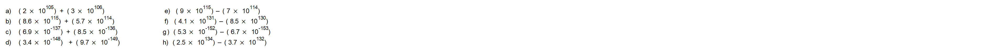
 
-  
 

- Write as a number 
 
-  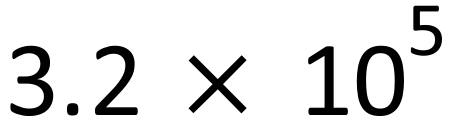
 

- Give your answers in standard form
- 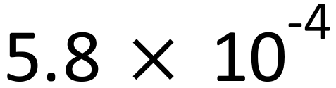
 
- 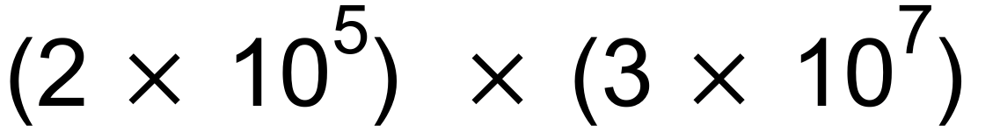

-  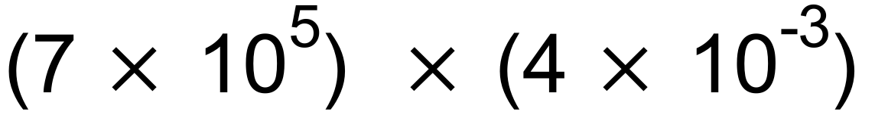
 
-  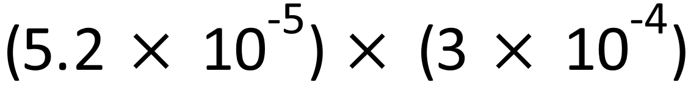
 
- 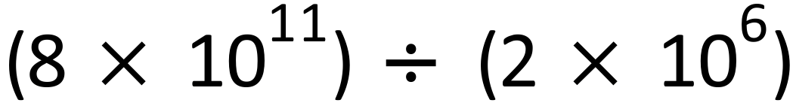
 
-  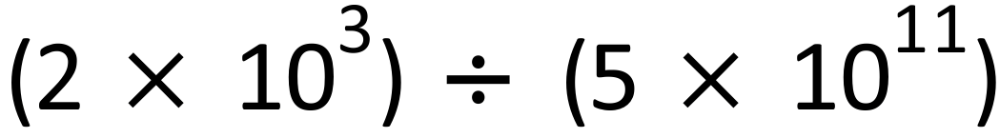
 
- 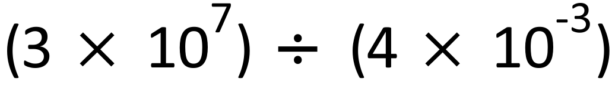

- 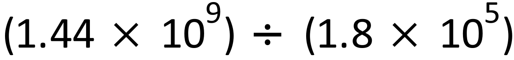

- Give your answers in standard form

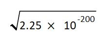

- The perimeter of a square region is  m. 

        (give your answers in standard form and to 2s.f.)

- Find the area. 
- Find the length of diagonal