# Yr 9 Shape Revision Spring

- Find the missing sides giving your answers correct to 3 significant figures. 

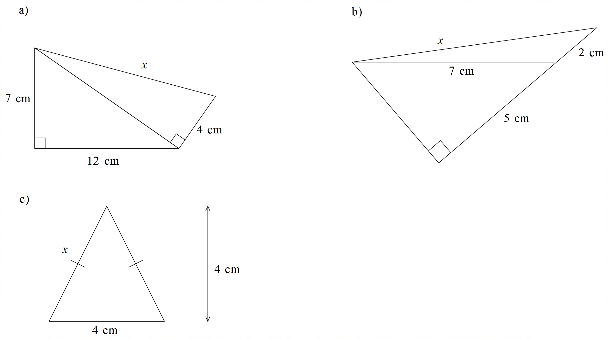

- Work out the following angles, clearly stating the reasons.

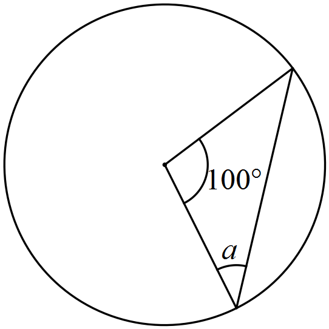
           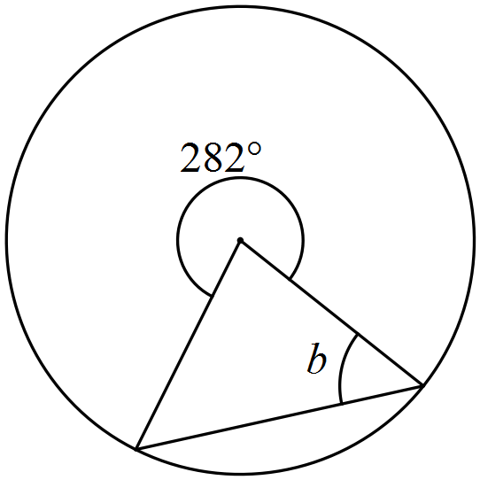
            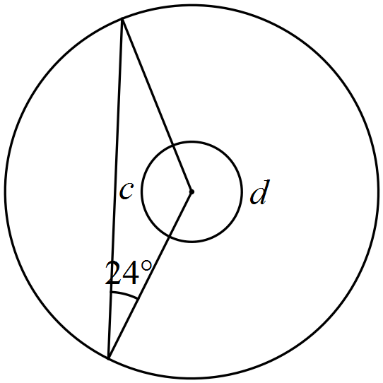
      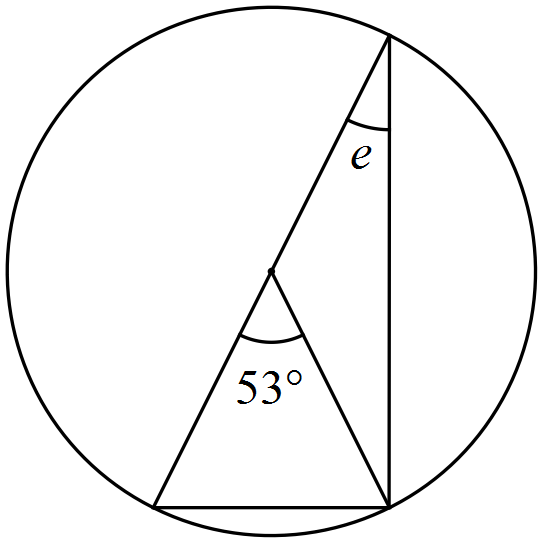
   

      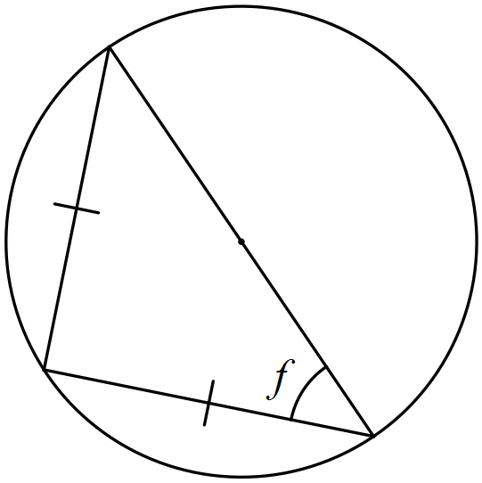
            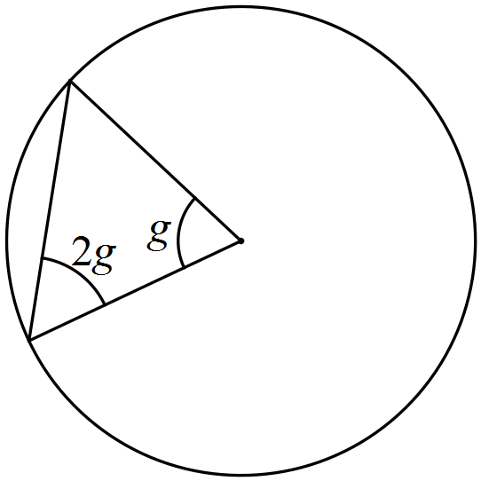
       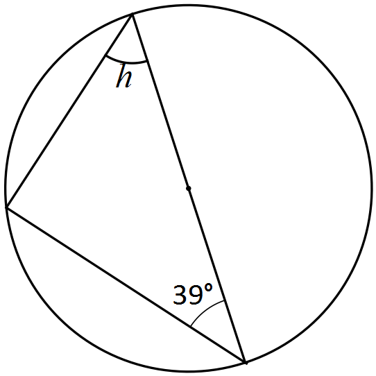
       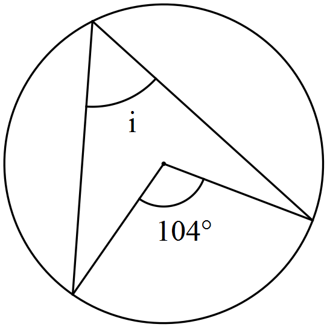
           

	

 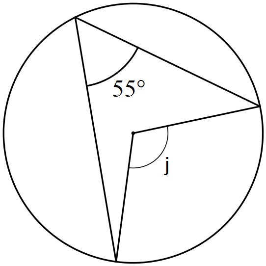
           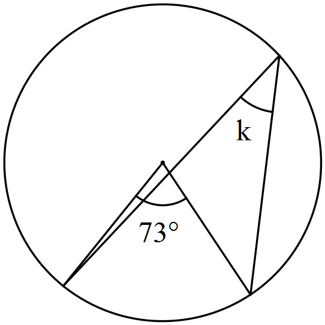
         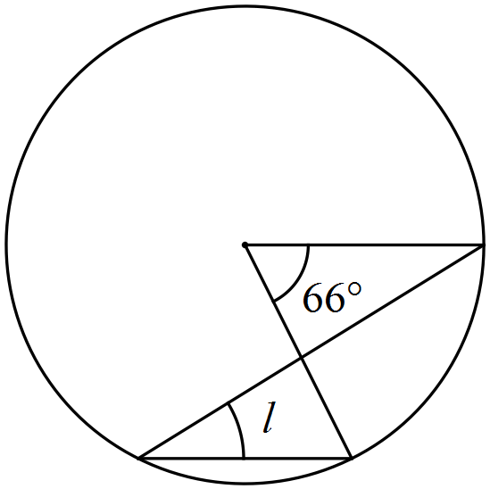
       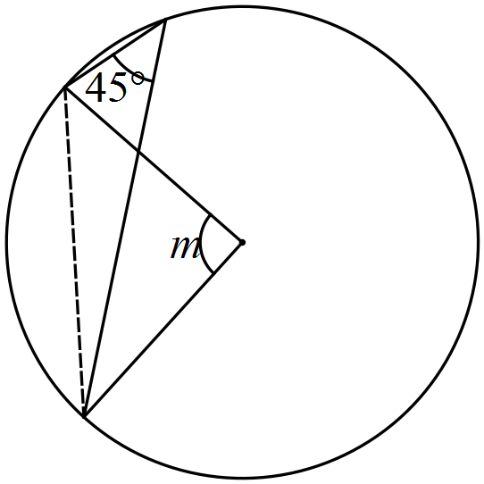
    

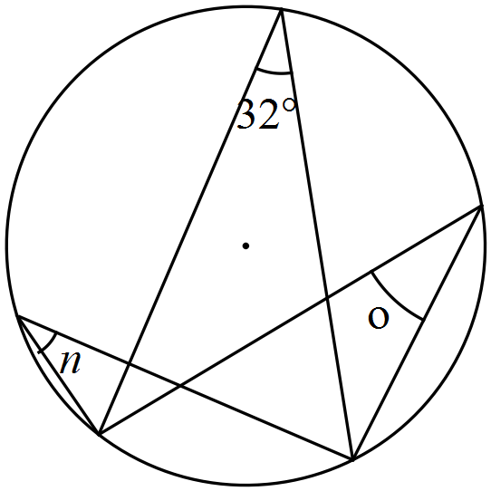
            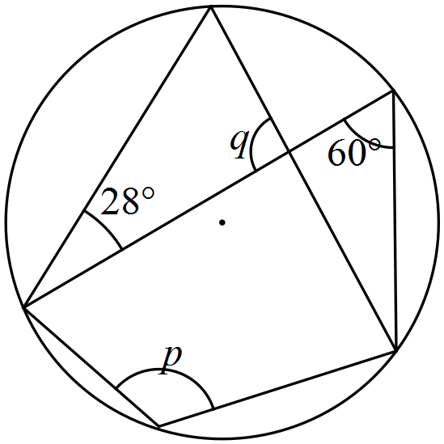
         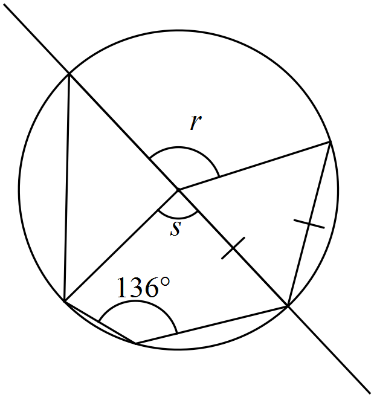
       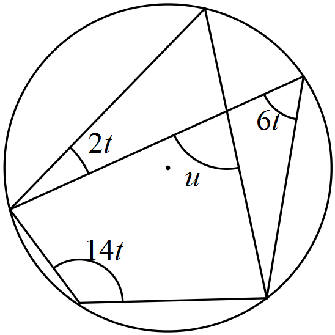
   

     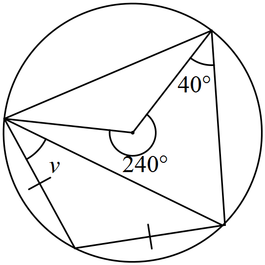
         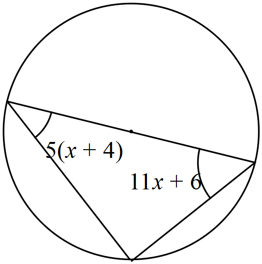
       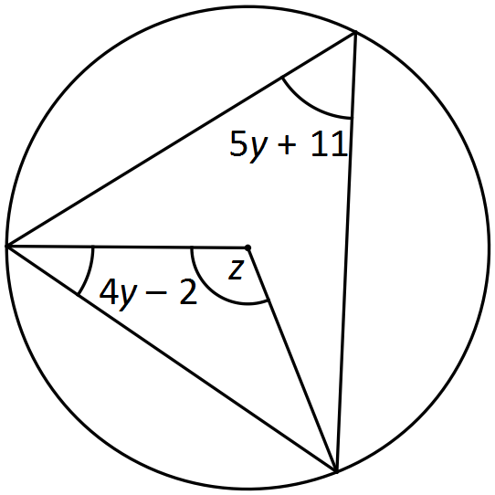
     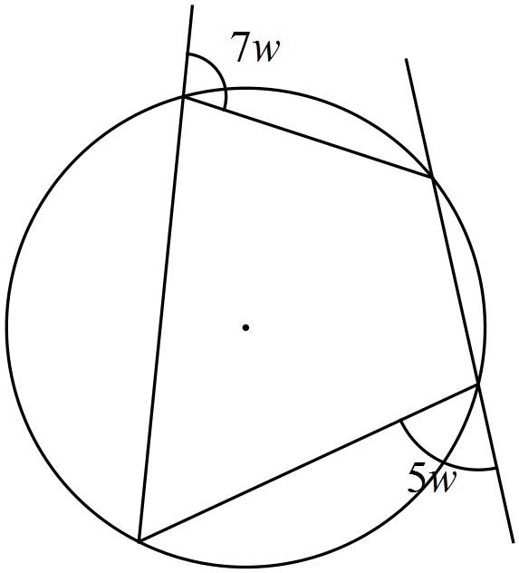