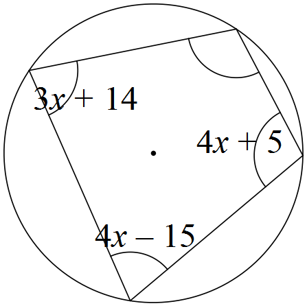

# Year 9 Algebra Revision Spring

## Simplify

1. $5x - 3 \leq 7$
2. $\frac{18xy}{9y}$
3. $\frac{24a^3b^5}{15a^4b}$
4. $\frac{9xy^6}{4x^3y^4} \times \frac{8x^2}{15y^3}$
5. $\frac{27x^2}{2x^3y} \div \frac{9x}{4y}$
6. $\frac{x+4}{2xy} \div \frac{2x+8}{8y^2}$
7. $\frac{3x+6}{3x}$
8. $\frac{9x^3y^2 - 18xy^2}{6xy^2}$
9. $\frac{6x^2 + 4x}{3x + 2}$

## Write the following as a single fraction

10. $\frac{(x+2)^3}{x+2}$
11. $\frac{a}{4} - \frac{b}{7}$
12. $\frac{2p+1}{3} + \frac{5p-2}{4}$
13. $\frac{x-2}{3} - \frac{7x+1}{5}$
14. $\frac{1}{3x} + \frac{2}{x}$
15. $\frac{4}{x} + 5$
16. $\frac{3}{a+1} + 5$
17. $\frac{3}{x+2} + \frac{5}{x}$
18. $\frac{7}{x-1} - \frac{3}{x+2}$

## Solve equations

19. $\frac{7}{y+5} + 2y$
20. $6x - 7 = 11$
21. $\frac{7x-3}{8} = 4$
22. $\frac{2}{7}x + 3 = 9$
23. $16 - 3x = 7$
24. $7x + 1 = 5x - 17$
25. $12 - 7x = 2x + 3$
26. $5(x - 2) = 2(3x - 7)$
27. $\frac{6x+3}{5} = 7 - 2x$
28. $5(2x + 3) - 2(x - 7) = (2 - x)$
29. $\frac{x}{4} - \frac{2x-1}{3} = \frac{x-5}{6}$
30. $\frac{1}{2}(x + 3) - \frac{1}{6}(2x - 4) = \frac{1}{3}(2 - x)$
31. $\frac{1}{2x} + \frac{3}{x} = 7$

## Solve equations

32. $\frac{5}{3x+4} = 2$
33. $\sqrt{x} + 5 = 7$
34. $7\sqrt{x+3} = 63$
35. $4\sqrt{x-2} = 1$
36. $\frac{\sqrt{x}}{5} + 6 = 7$
37. $\frac{\sqrt{x+7}}{2} = 5$
38. $5\sqrt{x} - 4 = 12 - 3\sqrt{x}$
39. $\frac{\sqrt{11x+3}}{3} = 2$
40. $\sqrt{\frac{7x+4}{5}} = 3$
41. $\sqrt{x-2} + 7 = 11$

## Solve the following equations

42. $5 - \sqrt{2x+4} = 2$
43. $x^2 + 4 = 13$
44. $3x^2 = 48$
45. $\frac{x^2}{12} + 5 = 8$
46. $3x^2 - 14 = 13$
47. $\frac{x^2+1}{5} = 13$
48. $5(3x^2 - 1) = 2(10 + 3x^2)$
49. $(x - 3)^2 = 81$
50. $\frac{(x+1)^2}{2} = 8$
51. $4(x - 5)^2 - 9 = 16$
52. $\frac{1}{9}(x - 5)^2 + 2 = 6$
53. $17 - \frac{(8x+4)^2}{3} = 5$

## Solve the following simultaneous equations

54. $\frac{7}{x-3} = x + 3$
55. $x + y = 12$ and $2x - y = 9$
56. $x - y = 9$ and $3x + 2y = 7$
57. $2x + 5y = 1$ and $3x - 2y = 11$
58. $y = 3x + 5$ and $y = 5x - 3$
59. $2x + 3y = 16$ and $x = 7 - 2y$
60. $\frac{1}{2}(x + 3y) = 11$ and $\frac{2}{3}(x + y) = 8$

## Factorise fully

61. $4a + 12$
62. $-6y - 2$
63. $12x + 21xy$
64. $16ab - 12bc$
65. $8a^2b - 12ab^5$
66. $4ab^3 - 15a^2b^2 + 20a^3b^5$
67. $9x^2y + 15x^3y^4 - 6x^2y^3$
68. $14x^2y^3z^5 + 21x^3yz^2 - 35x^2y^2z^3$
69. $8x^2y + 12x^3y^5 - (2xy^2)^3$
70. $x^2 - x$
71. $5x(x + 1) - 7(x + 1)$

## Solve the inequalities and illustrate the solution on the number line

72. $15x - 24$
74. $11 - 2x < 5$
75. $3 \leq 4x + 7 < 19$
76. $2x - 7 \leq 4x - 3 < x + 6$

## Word Problems

**For Q9 to Q16, set up an equation first and solve it to answer the question.**

77. Find all the angles of the cyclic quadrilateral.
    

78. The length of a rectangle is 5cm more than its width. Find the area of this rectangle if the perimeter is 26cm.

79. The sum of four consecutive numbers is 450. Find these numbers.

80. A two digit number is increased by 27 when the digits are reversed and the sum of the digits is 7. Find the original number.

81. Simon and Josh have £44 together. If Simon's money is doubled and Josh's tripled they will have £109 altogether. How much does each boy have?

82. Henry participates in 10K charity run (10 km). He runs some of it at 12km/h and walks the rest of the way at 4 km/h. He finishes in 1 hour. For how long and what distance did Henry run?

83. A book of 45 postage stamps contains both 1st and 2nd class stamps at price 62p for a 1st class and 53p for a 2nd class stamp. How many 1st class stamps are in the book if it costs £27.
