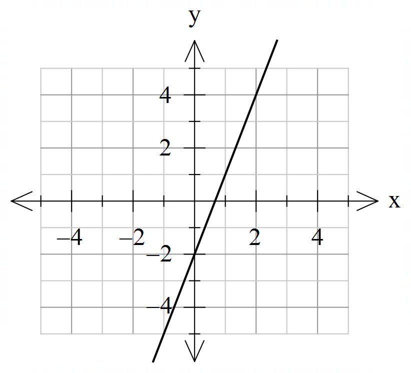
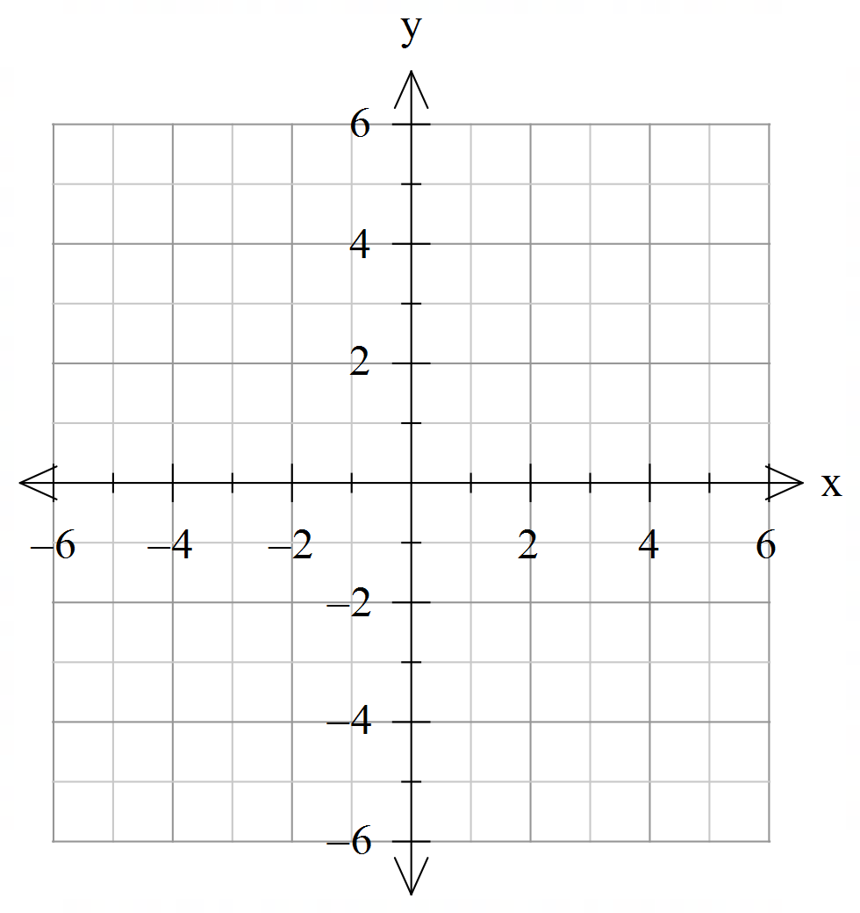
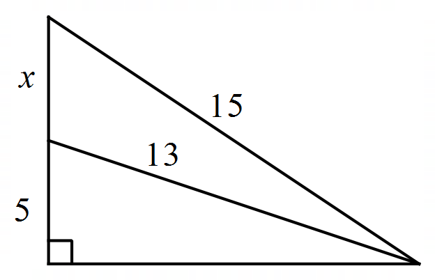
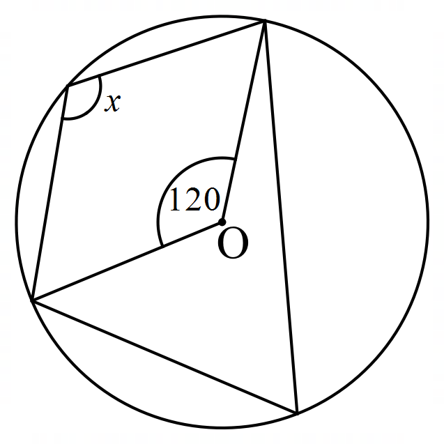

# Yr9 Spring R1

- Write in a standard form  				b.   

- Write as a number 				b.  

- Give your answers in standard form

        		b. 

- Give your answers in standard form

 		b. 

- Solve the following inequality and show the answers on a number line.	

	

- Solve the following equations
- 	 			b.  	
- Add the following algebraic fractions 				b.  		

- Simplify the following algebraic fractions				b.  	   

- Simplify the following algebraic fractions					b.  	   

- Find the equation of the line on the diagram below

- Find the gradient of line passing through the points  and 
- Find the gradient and intercept of the line .
- Find equation of line with gradient 5 and passing through point (3,20).
-  a.  Find the  and intercepts of line . 

 b.  Hence sketch the line.  

- a.   Draw lines  and  on the same set of axes:         

- Hence solve simultaneous equations graphically, using your graph.
- Find the missing side length in the diagram. 

  

- Find the angle , clearly state the reasoning.

	

- Solve the following equations	 			b.