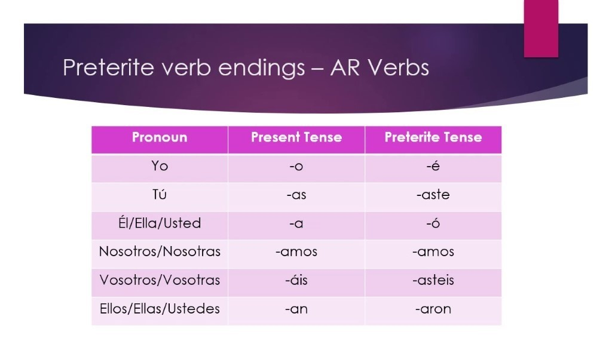
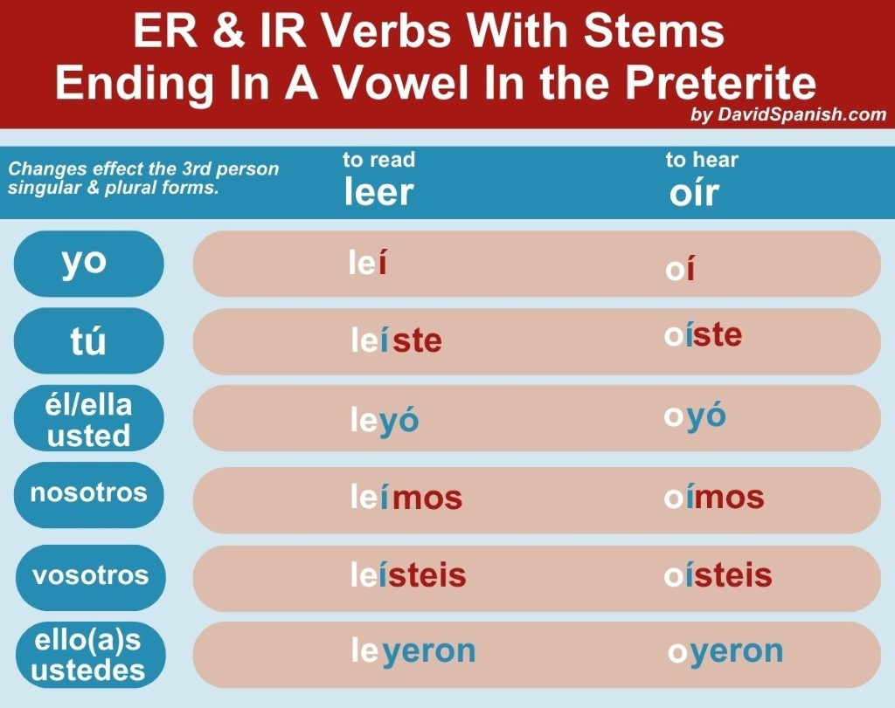
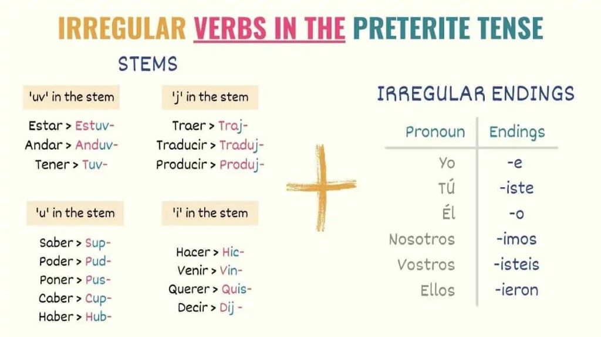
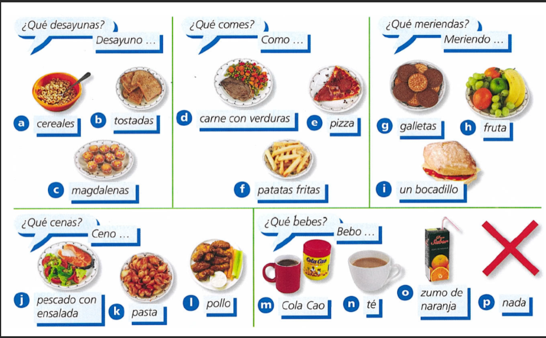

# Spanish Notes

## Revision Topic List (EOY 2026)
- [Preterite Tense: AR Verbs](#preterite-tense-ar-verbs-revision)
- [Preterite Tense: ER & IR Verbs](#preterite-tense-er--ir-verbs-revision)
- [Irregular Verbs in the Preterite](#irregular-verbs-in-the-preterite-revision)
- [Future Tense](#future-tense-revision)
- [Reflexive Verbs](#reflexive-verbs-revision)
- [Food Vocabulary](#food-vocabulary-revision)

## Curriculum Overview (2025-26)
**Textbook**: Viva 3 Rojo (GCSE Foundation)

### Autumn Term
- **Themes**: Hobbies and entertainment; birthdays; life as a celebrity; tasks of working life.
- **Grammar**: 
    - **Tenses**: Present tense (regular and irregular); Near future; Preterite (past) tense.
    - **Skills**: Learning to use three tenses (past, present, future) together effectively.

### Spring Term
- **Themes**: Future jobs; food, diet, and healthy living; daily routines and keeping fit.
- **Global Issues**: Children’s rights; recycling and environmental problems; describing my home town.
- **Grammar**:
    - **Pronouns & Verbs**: Direct object pronouns; stem-changing and reflexive verbs.
    - **Key Structures**: *Se debe* (one must); *Me duele* (it hurts me); *Poder* (to be able to).
    - **Tenses**: Introduction to the Imperfect tense.

### Summer Term
- **Themes**: Social interaction (meeting and greeting); buying souvenirs; insight into life in Madrid; communication issues.
- **Grammar**: 
    - **Tenses**: Completion of the Future tense.
    - **Comparisons**: Using the Comparative form.
    - **Idioms**: Expressions with *tener*.

---

## Grammar & Vocabulary (EOY Review)

### Preterite Tense: AR Verbs [REVISION]

### Preterite Tense: ER & IR Verbs [REVISION]

### Irregular Verbs in the Preterite [REVISION]

### Future Tense [REVISION]
- **Voy a + infinitive** (I am going to...)

### Reflexive Verbs [REVISION]
- **lavarse** (to wash oneself): Me lavo, Te lavas, Se lava, Nos lavamos, Os laváis, Se lavan.
- **despertarse** (to wake up): Me despierto, Te despiertas, Se despierta, Nos despertamos, Os despertáis, Se despiertan.
- **acostarse** (to go to bed): Me acuesto, Te acuestas, Se acuesta, Nos acostamos, Os acostáis, Se acuestan.
- **vestirse** (to dress oneself): Me visto, Te vistes, Se viste, Nos vestimos, Os vestís, Se visten.

### Food Vocabulary [REVISION]
- **Eggs (los huevos)**:
    - Fritos (fried)
    - Pasados por agua (soft boiled)
    - Revueltos (scrambled)
    - Al horno (baked)
- **La paella**:
    - De marisco (with seafood)
    - Negra (black)
    - Valenciana (from Valencia)
    - Vegetariana (vegetarian)

